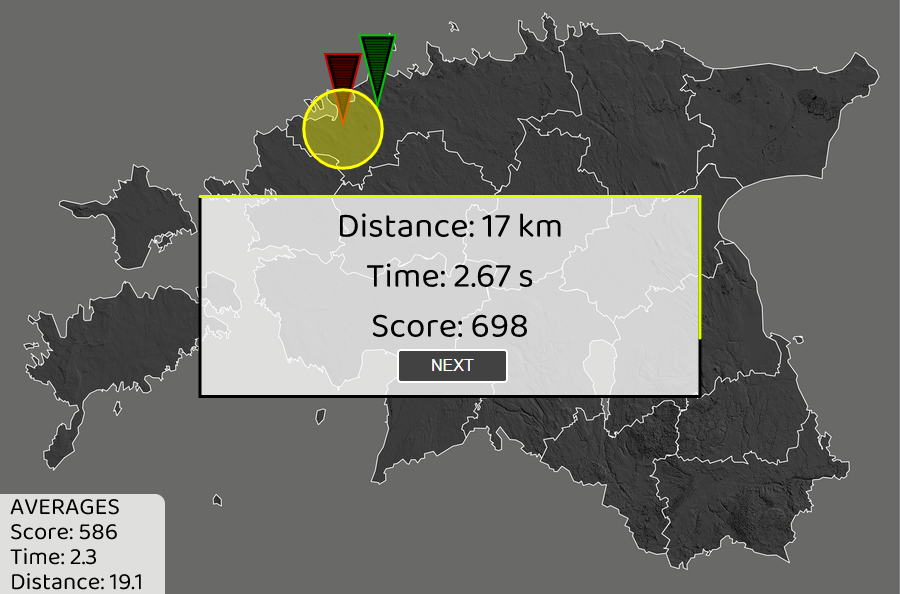

## A quiz game of Estonian cities
 
A quiz game where the goal is to mark Estonian cities as close and as fast as possible to their location on map. Client side uses [p5.js](https://p5js.org/) library for visuals and server side uses node.js for connecting to [MongoDB Atlas](https://www.mongodb.com/atlas/database) to query and write highscores. The background map is created with [QGIS](https://www.qgis.org/en/site/) software using data from [Estonian Land Board](https://maaamet.ee/en). 
 
 The game is deployed [here](https://estonian-city-quiz.herokuapp.com/)
 
 
